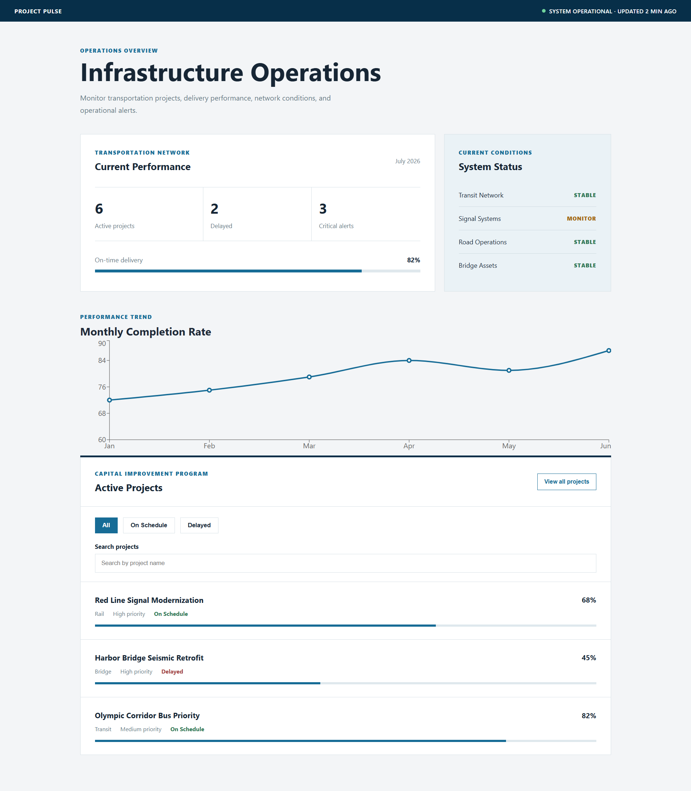

# Project Pulse

Project Pulse is a fictional infrastructure operations dashboard built with React.

I wanted to build something that felt closer to the kinds of internal tools used by engineering and infrastructure teams rather than another weather app or to-do list. The dashboard brings together project tracking, operational status, search, and reporting in a clean interface inspired by transportation and engineering organizations.

Project data is currently static and stored locally so the focus stays on React component architecture, state management, and frontend development.

## Live Demo

Deployed on AWS Amplify:

https://YOUR-AMPLIFY-URL.amplifyapp.com

## Features

- Infrastructure operations dashboard
- Project status overview
- Search projects by name
- Filter projects by status
- Monthly delivery trend chart
- Responsive layout
- Component-based React architecture

## Built With

- React
- JavaScript (ES6+)
- Recharts
- Vite
- CSS3
- AWS Amplify
- Git & GitHub

## Why I Built This

I built Project Pulse to strengthen my React skills while creating something inspired by the kinds of internal dashboards used by engineering teams.

Working on this project gave me experience organizing components, managing application state with React hooks, visualizing data with Recharts, and deploying a React application to AWS Amplify.

## Skills Practiced

- Building reusable React components
- Managing state with `useState`
- Passing data through props
- Conditional rendering
- Filtering and rendering data
- Responsive layouts with CSS
- Data visualization with Recharts
- Deploying with AWS Amplify

---

Built by **Frejya Lindh** as part of my frontend development portfolio.
